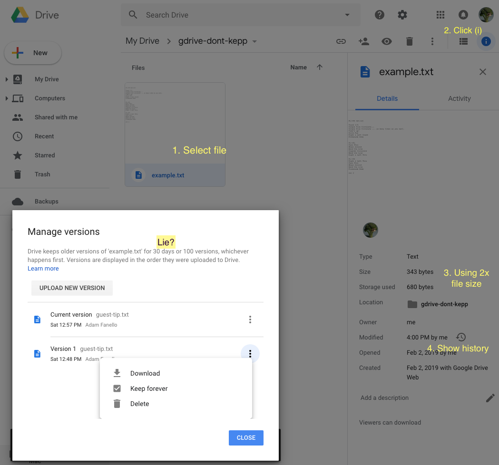

# G-Drive Don't Keep!

Google drive has a hidden bug. I see in on every account, but Google
support calls it a feature, while contradicting the official documentation.

What is this problem? **It never deletes anything!**

When you edit or overwrite a (not G-Suite) file, it is supposed to keep
the old revision of this file for 30 days before purging it. This lets
you revert back to the old revision. Most people don't even knows these
automatic backups are there, but they do count against your usage quota!

Fine. Dandy. But there's a bug. You see there's also a feature to go
make a revision as "Keep Forever", if you want. The bug is, _that option
is automatically set_! So while the documentation tells you that old
revisions will be deleted after 30 days, freeing up your disk quota,
they actually are _never deleted_!

Now, this does not happen with all files or all ways files are updated.
I haven't figured out the pattern. I can tell you two examples:

1. Upload a text file via https://drive.google.com. 
   - Edit the file locally, and upload it again.
2. Use Google Backup and Sync
   - Include an MP3 file in your local Google Drive folder. (Let it sync up.)
   - Edit that MP3 (change tags). (Let it sync.)
   
In both cases, you will find two revisions - the current one and the older
one with the _Keep Forever_ checkmark hidden within.



I discovered this when Google Backup and Sync told me that my data
was using 59 GB, but drive.google.com said I was using 108 GB.

Over going around in circles with Google support, I found the 
[Google Drive API](https://developers.google.com/drive/api/v3/about-sdk)
and wrote this script.

To run, clone this repository, cd into it, and run:
(Node.js v8 or later is required).

```
 npm install
 npm start
```


Follow the directions to authorize the application to access your
Google account - this will be saved to the `token.json` file and
remain valid for some times, so that you don't have to authorize
again if you run again soon.

This script takes a _very_ long time to run. It has to issue a
request to Google for every single file in your G-Drive, to check
the revisions on it, and another for to clear each _Keep Forever_ 
flags it finds. Plan to let it run over night - maybe longer.

By the time I had written this script, my usage had grown to 126 GB.
After running it, usage dropped to 71 GB. (Active file space was
around 60 GB, but some had been modified within 30 days and thus
had revisions not yet purged.)

Until Google fixes this behavior, you will need to re-run on occation
to find new revisions and clear the flag on them.

LEGAL DISCLAIMER: This script works for me, but I make no guarantees
what so ever that it will work for you. Some of your data will be
deleted. That is the purpose of this script. It should only be the
non-current historical revisions of files that were replaced over
30 days ago.
The source code is here, and you run it yourself. Use at your own risk. 

---

Using Node.js is an unreasonable requirement for most people. I wrote
this script to solve my own account, and share it _as open source_ for
anyone else to use. If you can make it more user friendly, please do.
Let me know about it and I'll link to your project.
